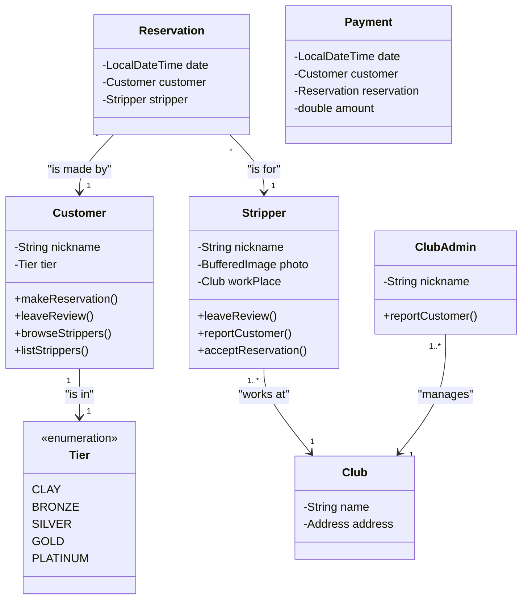
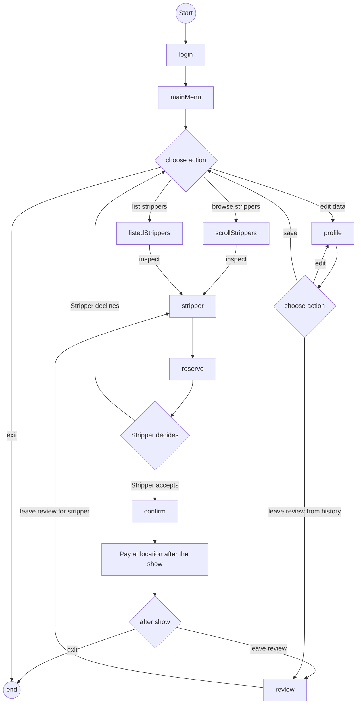
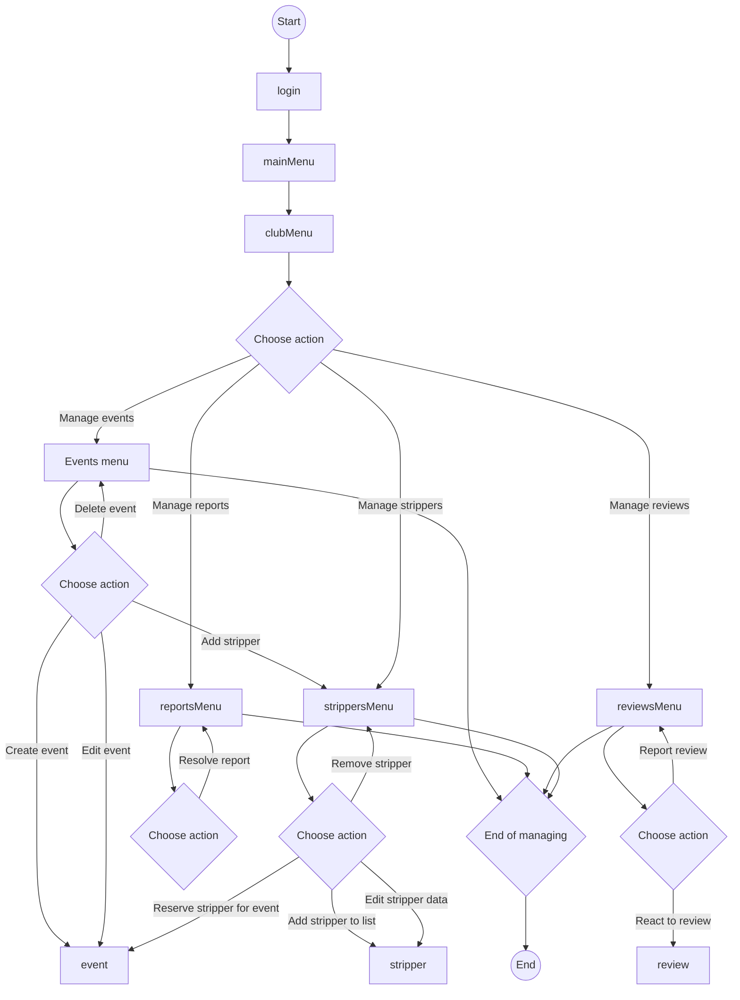
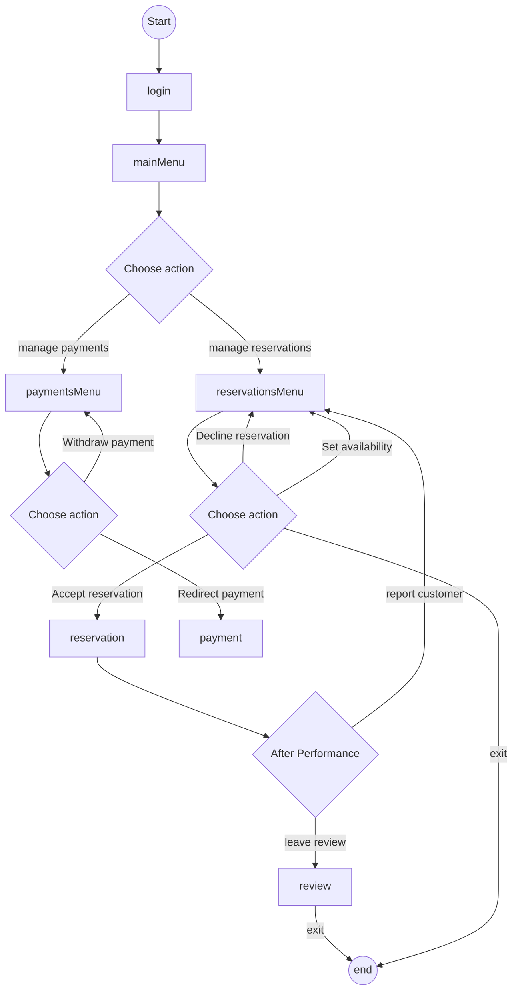
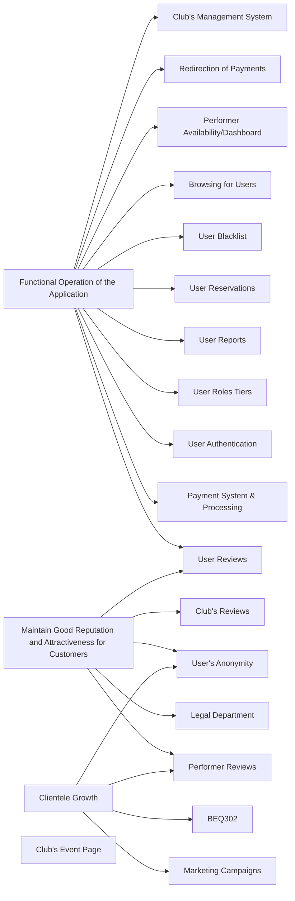

# Business plan for Sinners application

## Table of contents
1. [Business goals](#business-goals)
   1. [Primary Business Goals](#primary-business-goals)
   2. [Sub-Goals](#sub-goals)
2. [Justification of the Project](#justification-of-the-economic-feasibility-of-the-project)
3. [Business models](#business-models)
    1. [Business domain model](#business-domain-model)
    2. [Business process model](#business-process-model)
    3. [Business requirements](#business-requirements)

## Business goals [^1]

### Primary Business Goals

#### BG01: Functional Operation of the Application
##### Description:
This goal is considered fulfilled if we launch an application that is **functional, secure, reliable**, and ready for use by customers. Additionally, regular maintenance and a problem-solving system must be ensured to prevent sudden outages in the future.

#### BG02: Clientele Growth
##### Description:
This goal aims to establish a **long-term growth trend** in the number of clients, including both **strippers and customers**, as well as securing partnerships with clubs and eventually expanding into other cities.

#### BG03: Maintain a Good Reputation and Attractiveness for New and Existing Customers
##### Description:
The main pillar of this business goal is to **maintain and improve the positive media image** of our organization and striptease as a whole. Additionally, for our application, it is crucial to ensure the **functionality and reliability** of the review system and actively address any issues that arise to prevent mistrust due to technical or human failures.

### Sub-Goals

#### Sub-Goal 01: Actively Address Issues Raised by Customers → BG03
- This involves managing **blacklists** and excluding **difficult or inappropriate customers** as well as providing **functional customer support**.

#### Sub-Goal 02: Resolve Potential Legal Issues → BG03
- To achieve this goal, it is necessary to **anticipate potential problems** and resolve them, ensuring the **complete legal integrity and trustworthiness** of our organization. Specifically, we need to work with the **legal department** to create a strategy to address potential issues.

#### Sub-Goal 03: Create a Positive Public Perception of Striptease → BG02, BG03
- This goal is considered fulfilled if a **positive (or at least neutral) media image** of striptease is created, presenting it as a **unique form of art** that requires **talent and dedication** at a professional level, deserving proper recognition and appreciation.

#### Sub-Goal 04: Establish a Functional Marketing Model → BG02, BG03
- To achieve this goal, we need to practically test different forms of marketing, determine which is best suited for our purposes, and then use it consistently.

#### Sub-Goal 05: Expand to Other Cities → BG02
- This goal requires expanding operations to other cities, including all necessary **adjustments to the business model** for adapting to the specific environment.

#### Sub-Goal 06: Application Development → BG01
- The goal requires the creation of a **high-quality and user-friendly application** for our project.

#### Sub-Goal 07: Ensure a Competent Team for Technical Issue Resolution → BG01
- To achieve this goal, it is necessary to establish a **team capable of independently addressing technical issues** within the application, and to test its effectiveness during real operation.

back to [table of contents](#table-of-contents)
___

## Justification of the Economic Feasibility of the Project

### Costs & benefits [^2][^3] 
[Online spreadsheet with calculations](https://docs.google.com/spreadsheets/d/1pfv0A_9-FDrhvn3mnXLFHf2NRknKj2LlisVipGCFNmk/edit?gid=164423424#gid=164423424)

### Unit costs [^4]
Unit cost/cost per customer seems redundant in the context of our application as the price does not depend on the number of users unless the unexpectedly high volume requires more computation power. The only exception is the CAC (Customer Acquisition Cost), which determines how much money we spend for attracting 1 customer through marketing.

back to [table of contents](#table-of-contents)
___

## Business models

### Business domain model [^5]

#### Mock diagram

- This is purely mock diagram, the actual model should be made in EA
- for better model check presentation slide "Main business events"

back to [table of contents](#table-of-contents)
___

### Business process model [^6]

#### Mock example diagram
##### User experience process

##### Club management process

##### Stripper experience process

- These are purely mock diagrams, the actual models should be made in EA
- for better model check presentation slide "Main business events" and "Main business goals"

back to [table of contents](#table-of-contents)
___

### Business requirements [^7]
#### Business goals list
1. **BG01: Functional Operation of the Application**
2. **BG02: Clientele Growth**
3. **BG03: Maintain a Good Reputation and Attractiveness for New and Existing Customers**

#### Business requirements list
| ID | Requirment Name |
|----|-----------------|
| BRQ-001 | Payment system & processing |
| BRQ-002 | Marketing campaigns |
| BRQ-003 | Legal department |
| BRQ-101 | User authentication |
| BRQ-102 | User roles(tiers) | 
| BRQ-103 | User reviews | 
| BRQ-104 | User reports | 
| BRQ-105 | User reservations |
| BRQ-106 | User blacklist | 
| BRQ-107 | Browsing for users | 
| BRQ-108 | User's anonymity |
| BRQ-201 | Stripper's availability/dashboard |
| BRQ-202 | Stripper's reviews |
| BRQ-204 | Redirection of pay |
| BRQ-301 | Club's management system |
| BRQ-302 | Club's reviews |
| BRQ-303 | Club's event page |

back to [table of contents](#table-of-contents)
___

[^1]: Explanation - Business goals are the high-level objectives that the project aims to achieve. These could be strategic objectives, financial outcomes, or operational improvements. They guide the entire analysis by providing the rationale behind the project.

[^2]: Explanation - Total Cost of Ownership (TCO) refers to the complete cost of owning and operating the project over its lifecycle. This includes initial costs, maintenance, and other operational costs.

[^3]: Explanation - This section should list the financial and non-financial benefits the project will bring. Financial benefits could include revenue increases or cost savings, while non-financial benefits might be improvements in customer experience or brand value.

[^4]: Explanation - Unit costs refer to the cost per unit of output, such as the cost per customer, transaction, or product sold. It helps quantify the impact of the project.

[^5]: Explanation - The Business Domain Model describes the core concepts and relationships within the business. Using a UML class diagram, you can model entities (like Customers, Orders, Products) and how they interact.

[^6]: Explanation - The Business Process Model captures how business processes flow within the project. UML Activity Diagrams are used to model these processes as sequences of activities or tasks.

[^7]: Explanation - This section defines the business requirements and links them back to the business goals. A UML Requirements Diagram helps visualize how specific requirements are tied to goals.

back to [table of contents](#table-of-contents)
