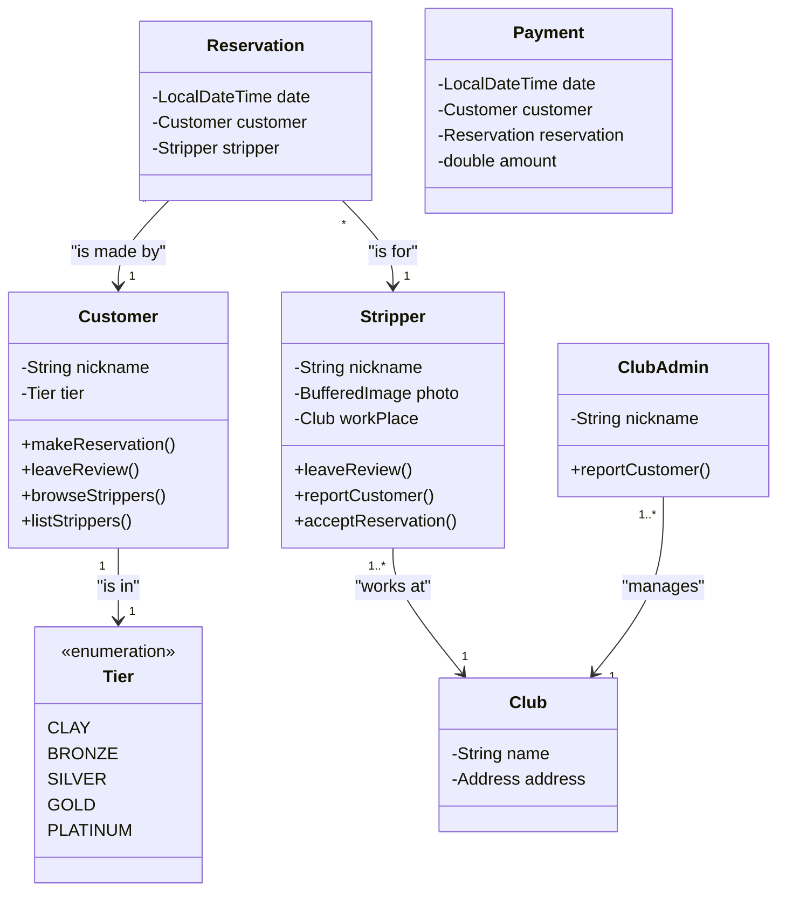
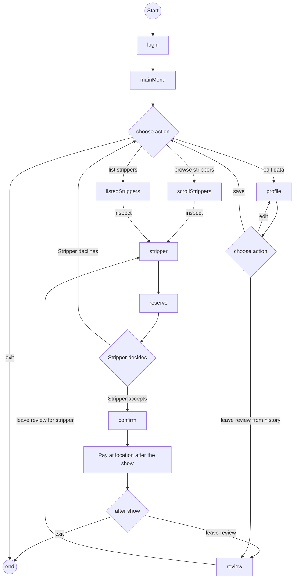
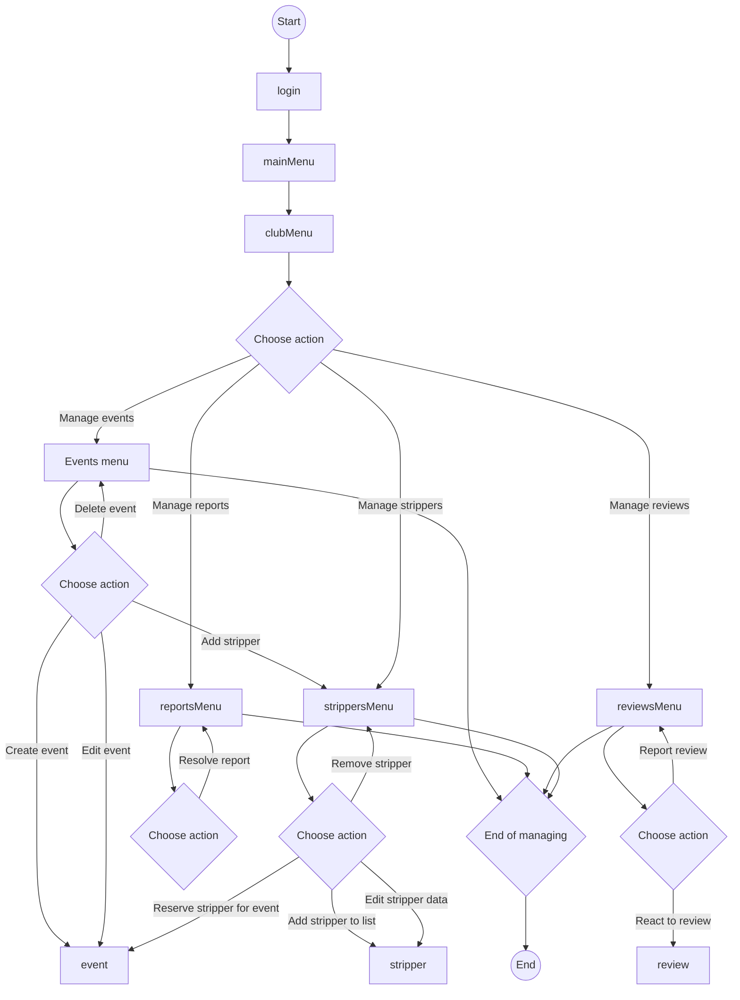

# Business plan for Sinners application

## Table of contents
1. [Business goals](#business-goals)
2. [Justification of the Project](#justification-of-the-economic-feasibility-of-the-project)
3. [Business models](#business-models)
    1. [Business domain model](#business-domain-model)
    2. [Business process model](#business-process-model)
    3. [Business requirements](#business-requirements)

## Business goals [^1]

### Primary Business Goals for the First Year

#### 1. Achieve Profitability
##### Checkpoints to Meet This Goal:
- The application is operational, with enough clients to cover costs (see financial analysis).
- There are no legal conflicts.
- Effective marketing is in place.

#### 2. Launch the Application
##### Checkpoints to Meet This Goal:
- The application is functional, secure, and reliable.
- Regular maintenance is ensured to prevent sudden outages.

#### 3. Attract Strippers as Clients
##### Checkpoints to Meet This Goal:
- The application is functional and user-friendly.
- The organization appears trustworthy.
- No legal issues are associated with using the application.
- Effective marketing and advertising campaigns are in place.

#### 4. Secure Partnerships with Clubs
##### Checkpoints to Meet This Goal:
- The application is functional and user-friendly.
- The organization appears trustworthy.
- No legal issues are associated with using the application.
- Effective marketing and advertising campaigns are in place.

#### 5. Attract Customers from the General Public
##### Checkpoints to Meet This Goal:
- The application is functional and user-friendly.
- The organization appears trustworthy.
- No legal issues are associated with using the application.
- Effective marketing and advertising campaigns are in place.
- The public is familiar with the vision and mission of the organization.
- Gradually reducing the taboo around striptease as an artistic expression.
- Targeting customers from the mainstream public.

#### 6. Actively Address Issues Raised by Customers, Clubs, and Employees
##### Checkpoints to Meet This Goal:
- Maintaining blacklists and excluding difficult or inappropriate customers.
- Ensuring efficient customer support.

#### 7. Resolve Potential Legal Issues
##### Checkpoints to Meet This Goal:
- Anticipate potential problems and address them.
- Ensure complete legal compliance and build the organization's trustworthiness.
- Work with the legal department to develop a strategy to handle potential issues.

#### 8. Create a Positive Public Perception of Striptease
##### Checkpoints to Meet This Goal:
- Effective advertising and marketing, especially on social media.
- Establish a positive (or at least neutral) media image of striptease as a unique art form that requires talent and dedication on a professional level.
- Ensure the public understands the difference between striptease and prostitution.
- Encourage discussions on the topic via social media and mainstream media.

### Goals for Future Years

#### 1. Maintain a Good Reputation and Attractiveness for New and Existing Customers
##### Checkpoints to Meet This Goal:
- Ensure the functionality and reliability of review systems and problem resolution.
- Continue to maintain and enhance the positive media image of the organization and striptease.

#### 2. Increase Profits
##### Checkpoints to Meet This Goal:
- Expand the clientele in Prague and grow into other cities.

#### 3. Expand to Other Cities
##### Checkpoints to Meet This Goal:
- More intensive marketing efforts.
- Ensure the application can handle increased demand.
- Continue to improve the organization's reputation and media image.
- Continue to challenge the taboos around striptease and our services.

## Justification of the Economic Feasibility of the Project

### Costs [^2] 

### Benefits [^3]

### Unit costs [^4]

## Business models

### Business domain model [^5]

#### Mock diagram

- This is purely mock diagram, the actual model should be made in EA
- for better model check presentation slide "Main business events"

___

### Business process model [^6]

#### Mock example diagram
##### User experience process

##### Club management process

- These are purely mock diagrams, the actual models should be made in EA
- for better model check presentation slide "Main business events" and "Main business goals"

___

### Business requirements [^7]
**These should be done after the business goals are set**

#### Business goals list
1. Achieve Profitability
2. Launch the Application
3. Attract Strippers as Clients
4. Secure Partnerships with Clubs
5. Attract Customers from the General Public
6. Actively Address Issues Raised by Customers, Clubs, and Employees
7. Resolve Potential Legal Issues
8. Create a Positive Public Perception of Striptease
9. Maintain a Good Reputation and Attractiveness for New and Existing Customers
10. Increase Profits
11. Expand to Other Cities

#### Business requirements list
| ID | Requirment Name |
|----|-----------------|
| BRQ-001 | Payment system & processing |
| BRQ-002 | Marketing campaigns |
| BRQ-003 | Legal department |
| BRQ-101 | User authentication |
| BRQ-102 | User roles(tiers) | 
| BRQ-103 | User reviews | 
| BRQ-104 | User reports | 
| BRQ-105 | User reservations |
| BRQ-106 | User blacklist | 
| BRQ-107 | Browsing for users | 
| BRQ-108 | User's anonymity |
| BRQ-201 | Stripper's availability/dashboard |
| BRQ-202 | Stripper's reviews |
| BRQ-203 | Stripper's tips |
| BRQ-204 | Redirection of pay |
| BRQ-301 | Club's management system |
| BRQ-302 | Club's reviews |
| BRQ-303 | Club's event page |

___

back to [table of contents](#table-of-contents)

---

[^1]: Explanation - Business goals are the high-level objectives that the project aims to achieve. These could be strategic objectives, financial outcomes, or operational improvements. They guide the entire analysis by providing the rationale behind the project.

[^2]: Explanation - Total Cost of Ownership (TCO) refers to the complete cost of owning and operating the project over its lifecycle. This includes initial costs, maintenance, and other operational costs.

[^3]: Explanation - This section should list the financial and non-financial benefits the project will bring. Financial benefits could include revenue increases or cost savings, while non-financial benefits might be improvements in customer experience or brand value.

[^4]: Explanation - Unit costs refer to the cost per unit of output, such as the cost per customer, transaction, or product sold. It helps quantify the impact of the project.

[^5]: Explanation - The Business Domain Model describes the core concepts and relationships within the business. Using a UML class diagram, you can model entities (like Customers, Orders, Products) and how they interact.

[^6]: Explanation - The Business Process Model captures how business processes flow within the project. UML Activity Diagrams are used to model these processes as sequences of activities or tasks.

[^7]: Explanation - This section defines the business requirements and links them back to the business goals. A UML Requirements Diagram helps visualize how specific requirements are tied to goals.
