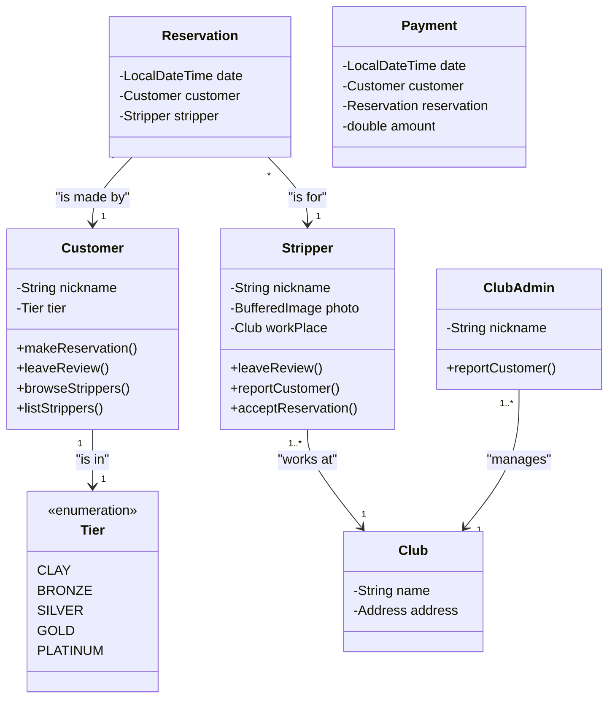
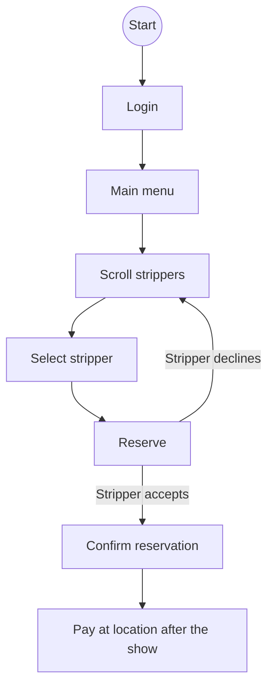

# Business plan for Sinners application

## Business goals [^1]

## Justification of the Economic Feasibility of the Project

### Costs [^2] 

### Benefits [^3]

### Unit costs [^4]

## Business models

### Business domain model [^5]

#### Mock diagram

- This is purely mock diagram, the actual model should be made in EA
- for better model check presentation slide "Main business events"

___

### Business process model [^6]

#### Mock example diagram

- This is purely mock diagram, the actual model should be made in EA
- for better model check presentation slide "Main business events" and "Main business goals"

___

### Business requirements [^7]

[^1]: Explanation - Business goals are the high-level objectives that the project aims to achieve. These could be strategic objectives, financial outcomes, or operational improvements. They guide the entire analysis by providing the rationale behind the project.

[^2]: Explanation - Total Cost of Ownership (TCO) refers to the complete cost of owning and operating the project over its lifecycle. This includes initial costs, maintenance, and other operational costs.

[^3]: Explanation - This section should list the financial and non-financial benefits the project will bring. Financial benefits could include revenue increases or cost savings, while non-financial benefits might be improvements in customer experience or brand value.

[^4]: Explanation - Unit costs refer to the cost per unit of output, such as the cost per customer, transaction, or product sold. It helps quantify the impact of the project.

[^5]: Explanation - The Business Domain Model describes the core concepts and relationships within the business. Using a UML class diagram, you can model entities (like Customers, Orders, Products) and how they interact.

[^6]: Explanation - The Business Process Model captures how business processes flow within the project. UML Activity Diagrams are used to model these processes as sequences of activities or tasks.

[^7]: Explanation - This section defines the business requirements and links them back to the business goals. A UML Requirements Diagram helps visualize how specific requirements are tied to goals.
